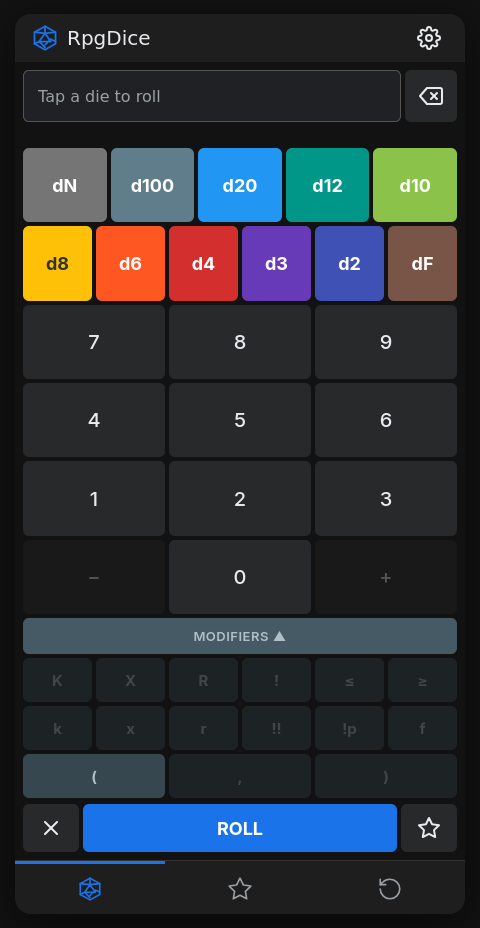
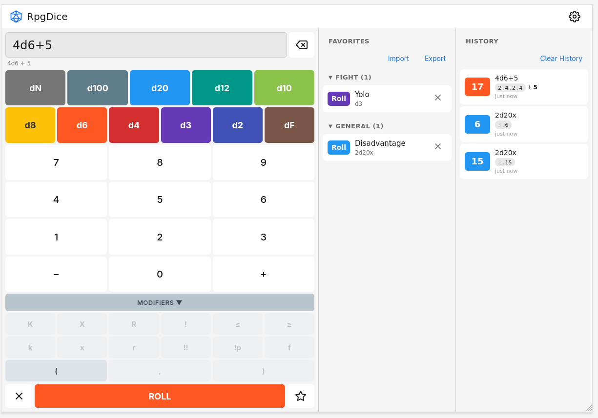

# RpgDice

RpgDice is a responsive web-based dice roller for tabletop RPGs. It features a Material Design interface with a multi-panel layout that adapts to phones, tablets, and desktops.

**[Try the Live Demo](https://mxkolb30.github.io/rpg-dice/)**





## Features

- **Smart Input:** Automatically groups identical dice (e.g. 2d6) and handles summing between different dice types and constants.
- **Custom Dice:** Support for dN dice where the number of sides can be manually entered.
- **Advanced Modifiers:** Keep/drop highest/lowest, exploding dice, rerolls, penetrating dice, failure counting, and grouped rolls.
- **Dynamic Theming:** The interface color palette updates in real-time based on the first die type in the current formula.
- **Light & Dark Theme:** Follows system preference by default, or choose manually in settings.
- **Responsive Layout:** Single column on phones, two panels (dice + favorites) on tablets, three panels (dice + favorites + history) on desktops.
- **Result Breakdown:** Dice rolls shown in pill chips with color-coded crits/fumbles, operators between groups, and dice-type labels.
- **History and Favorites:** Persistent storage for previous rolls and frequently used formulas. CSV import/export for favorites.
- **Internationalization:** English and German, with easy addition of new languages.
- **PWA Support:** Installable as a Progressive Web App with offline functionality via Service Workers.
- **Mobile Optimized:** Designed for modern tall phone screens with bottom navigation and safe-area support. Compact layout adapts to smaller screens (iPhone SE and similar).

## Getting Started

RpgDice is a static web application. No build process is required.

### Local Development

Open `index.html` in a web browser, or serve the directory using a local web server:

```bash
# Node.js
npx serve .

# Python
python3 -m http.server 8000
```

### Running Tests

```bash
node test/test.js
```

## Project Structure

```
├── index.html          # Main HTML
├── css/style.css       # Styles with CSS variables, light/dark themes
├── js/
│   ├── state.js        # App state, defaults, DOM helpers
│   ├── theme.js        # Theme switching (auto/light/dark)
│   ├── sound.js        # Audio playback, wake lock
│   ├── dice.js         # Dice rolling engine
│   ├── input.js        # Button state machine, input handlers
│   ├── roll.js         # Roll execution, result rendering
│   ├── history.js      # Roll history
│   ├── favorites.js    # Favorites management
│   ├── csv.js          # CSV import/export
│   ├── settings.js     # Settings modal, PWA update
│   ├── i18n.js         # Internationalization engine
│   └── app.js          # Tab navigation, responsive layout, init
├── lang/
│   ├── en.js           # English translations
│   └── de.js           # German translations
├── sw.js               # Service worker for offline PWA
├── manifest.json       # PWA manifest
├── test/test.js        # Unit tests
├── icons/              # App icons
└── sounds/             # Sound effects
```

## Technical Stack

- Vanilla JavaScript (ES6+), no build step or bundler
- Modern CSS (Flexbox, CSS Variables, Media Queries, Safe-area insets)
- SVG icons
- LocalStorage API for persistence
- Service Worker API for offline PWA support
